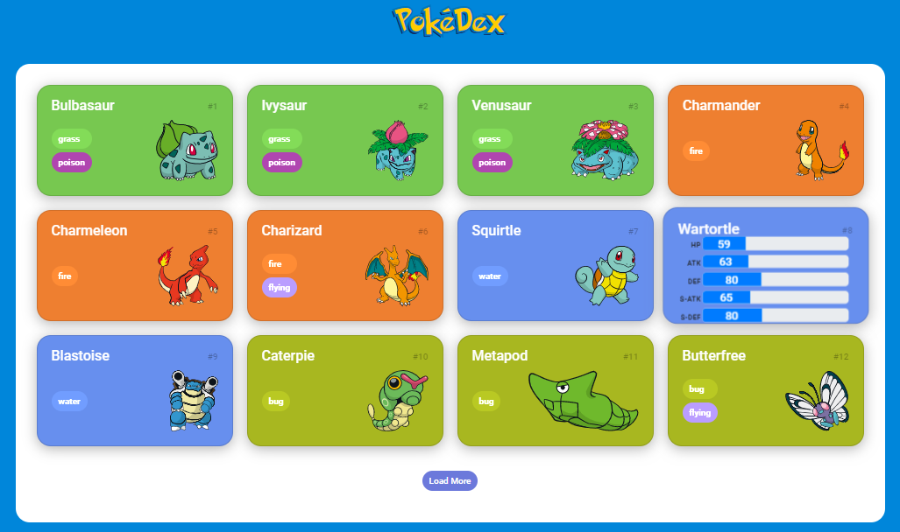

<h1 align="center"> PokéDex </h1>

O projeto consiste em uma PokéDex que consome a pokeAPI para gerar pokemons e seus detalhes.   

  <a href="#-tecnologias">Tecnologias</a>&nbsp;&nbsp;&nbsp;|&nbsp;&nbsp;&nbsp;
  <a href="#-projeto">Projeto</a>&nbsp;&nbsp;&nbsp;|&nbsp;&nbsp;&nbsp;
  <a href="#-layout">Layout</a>&nbsp;&nbsp;&nbsp;|&nbsp;&nbsp;&nbsp;
  <a href="#memo-licença">Licença</a>

  

 

  

## 🚀 Tecnologias

Esse projeto foi desenvolvido com as seguintes tecnologias:

- HTML e CSS
- [Bootstrap](https://https://getbootstrap.com/)
- Vanilla JavaScript

## 💻 Projeto

A PokéDex é um aplicativo web que consome a [pokeAPI](https://pokeapi.co) para gerar os cards com os pokemons, contendo nome, imagem, id e tipos. Ao passar o mouse sobre o card a foto e os tipos somem parar dar lugar aos stats do pokemon, contendo HP, ATK, DEF, SPECIAL ATK e SPECIAL DEF em barras de progresso com seus respectivos valores. Ao final da página existe o botão "Load More" que ao ser clicado gera mais cards, dando continuidade a sequência de pokemons.
Implementações futuras: Barra de pesquisa, filtragem por tipos.

## 📝 Aprendizados

Com este projeto pude reforçar meus conhecimentos em vanilla JS, principalmente utilizando o método fetch() e Promise para consumir a API e gerando o HTML dos cards através da manipulação da DOM.
Além da estrutura HTML e CSS responsivo, utilizei o framework Bootstrap para gerar as barras de progresso dos stats dos pokemons.

## 📇 Licença

Esse projeto está sob a licença MIT.

---
